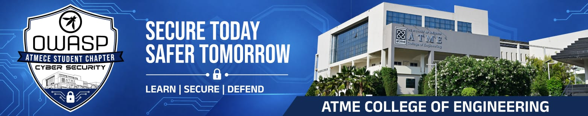

---

layout: col-sidebar
title: OWASP ATME College of Engineering, Mysuru
tags: OWASP ATMECE
level: 2
region: Asia
country: India
postal-code: 570028

---

## Welcome to the OWASP ATMECE Student Chapter
---

<!-- -->

**ATME College of Engineering**, Mysuru, established in 2010, is committed to providing holistic education with the student community at the heart of the learning process. The institution fosters a motivating and inclusive environment that encourages knowledge assimilation, innovation, social responsibility, and the development of strong human values.

The **OWASP ATMECE Student Chapter** is a community where students, faculty, cybersecurity professionals, and enthusiasts come together to learn, collaborate, and explore the world of cybersecurity. Led by Prof. Yogesh N as Faculty Leader and Mohith Krishna K as Student Leader, the chapter is built around hands-on learning, skill development, and practical, real-world cybersecurity knowledge. Through workshops, projects, CTFs, discussions, and continuous knowledge sharing, we aim to help members build strong technical skills and a deep understanding of secure development and cybersecurity best practices. Whether you're just starting out or already experienced in the field, the OWASP ATMECE Student Chapter is a space to learn, connect, collaborate, and grow together — welcome aboard!

## Vision

To establish a vibrant OWASP Student Chapter at ATMECE where students, faculty, industry professionals, and cybersecurity enthusiasts collaborate to address real-world security challenges.

## Mission 

- ⁠To empower students and faculty through hands-on cybersecurity learning, knowledge sharing, skill development, and continuous engagement with OWASP practices and industry expertise.
- To foster collaborative problem-solving and innovation by connecting students, faculty, industry professionals, and cybersecurity enthusiasts to address real-world security challenges and promote secure development practices.

## Participation
The Open Worldwide Application Security Project (OWASP) is a nonprofit foundation that works to improve the security of software. All of our projects, tools, documents, forums, and chapters are free and open to anyone interested in improving application security. 

Chapters are led by local leaders in accordance with the [Chapters Policy](/www-policy/operational/chapters). Financial contributions should only be made online using the authorized online donation button. 

Everyone is welcome and encouraged to participate in our [Projects](/projects/), [Local Chapters](/chapters/), [Events](/events/), [Online Groups](https://groups.google.com/a/owasp.com/){:target='_blank'}, and [Community Slack Channel](https://owasp.slack.com/){:target='_blank'}. We especially encourage diversity in all our initiatives. OWASP is a fantastic place to learn about application security, to network, and even to build your reputation as an expert. We also encourage you to be [become a member](/membership/) or consider a [donation](/donate/) to support our ongoing work.

Next Meeting/Event <!-- You should keep this section as it will populate your meetup events -->
---------------------
## Our Upcoming Events !

- Stay connected for more updates, opportunities, and initiatives from our chapter. Keep learning, keep exploring, and keep building a more secure digital future together. 🔐🚀

Something exciting is on the horizon. Stay connected with OWASP ATMECE and be part of what’s next! 🌟
-  <a href="https://www.linkedin.com/company/owasp-atmece" target="_blank" >  Linkedin</a>  
-  <a href="https://www.instagram.com/owasp_atmece/" target="_blank" >   Telegram</a>  

